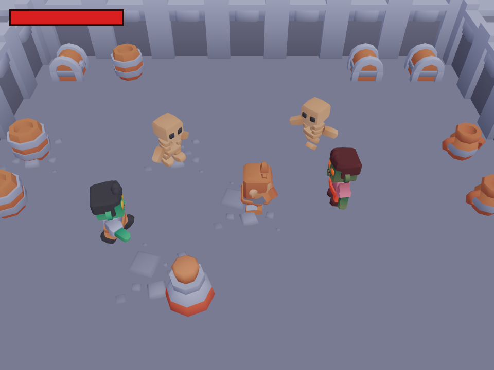
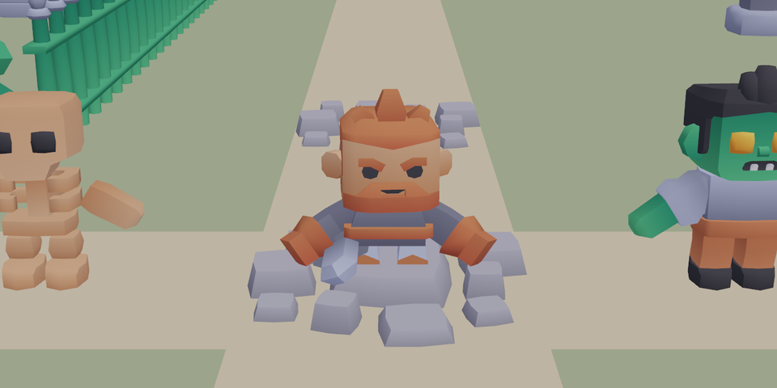
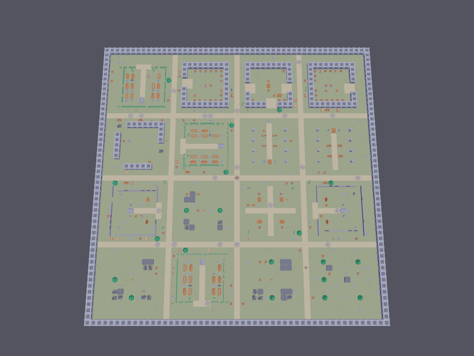
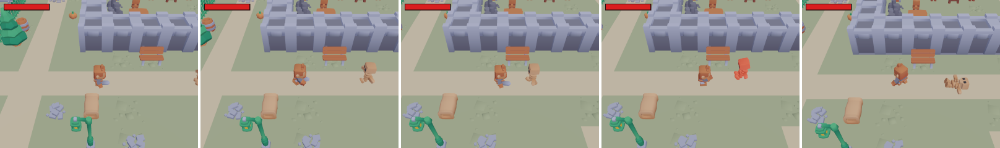

# WM_test1 — 액션 게임 월드모델



**키보드 입력을 받아 다음 게임 화면을 "상상해서" 그려내는 신경망(월드모델)을 처음부터 끝까지 직접 만들어 보는 프로젝트**입니다.

작은 탑다운 액션 게임을 직접 만들고, 스크립트 봇과 사람이 그 게임을 플레이한 기록(화면 + 키 입력) 약 21만 프레임을 모아, 확산(diffusion) 모델이 **"지금까지의 화면 + 지금 누른 키 → 다음 화면"** 을 학습하게 했습니다. 학습된 모델을 실행하면 실제 게임 대신 모델이 매 프레임을 생성하고, 사람은 그 안에서 WASD와 Space로 플레이할 수 있습니다.

```
게임 (Panda3D, Kenney 에셋)  →  봇 플레이 데이터 수집  →  서버에서 학습 (4×GPU)  →  각자 PC에서 모델 안에서 플레이
     play.py                      collect.py                 wm_server/train.py           play_model.py
```

---

## ★ Quick start for inference

학습된 가중치를 받아 **내 컴퓨터에서 월드모델을 직접 조작**해 보는 방법입니다. 순서대로 따라 하면 됩니다.

### 0. 준비물

- Windows 10/11 또는 Linux, [Python](https://www.python.org/downloads/) 3.10 ~ 3.13, [git](https://git-scm.com/downloads)
- **NVIDIA GPU 권장** (그래픽 드라이버는 최신으로). GPU 없이도 돌아가지만 1초에 1장도 안 나옵니다.

### 1. 코드 받기

```bash
git clone https://github.com/dhlee9255/WM_test1.git
cd WM_test1
```

### 2. 가상환경 만들기

```powershell
# Windows (PowerShell)
python -m venv .venv
.venv\Scripts\activate
```
```bash
# Linux / macOS
python3 -m venv .venv
source .venv/bin/activate
```

> Windows에서 `activate` 가 "스크립트를 실행할 수 없습니다"로 막히면 먼저 `Set-ExecutionPolicy -Scope CurrentUser RemoteSigned` 를 한 번 실행하세요.

### 3. PyTorch 설치 — **내 GPU에 맞는 것 하나만**

GPU 세대마다 맞는 PyTorch 빌드가 다릅니다. 그냥 `pip install torch` 를 하면 Windows에서는 GPU를 못 쓰는 CPU 전용판이 깔리니 주의하세요.

| 내 GPU | 설치 명령 |
|---|---|
| **RTX 50 시리즈** (5060 / 5070 / 5080 / 5090) — 드라이버 570 이상 필요 | `pip install torch --index-url https://download.pytorch.org/whl/cu128` |
| **RTX 20 / 30 / 40 시리즈, GTX 16 / 10 시리즈, MX 시리즈** | `pip install torch --index-url https://download.pytorch.org/whl/cu126` |
| NVIDIA GPU 없음 (CPU로 실행, 매우 느림) | `pip install torch` |

내 GPU 이름은 `nvidia-smi` 명령으로 확인할 수 있습니다.

### 4. 나머지 패키지와 게임 에셋

```bash
pip install -r requirements.txt
python setup_assets.py
```

`setup_assets.py` 는 게임 3D 모델(Kenney, 무료)을 내려받아 변환합니다. 처음 한 번만 하면 됩니다.

### 5. 가중치 받기

[**Releases**](https://github.com/dhlee9255/WM_test1/releases/latest) 에서 `wm_v2.pt` (약 64MB)를 내려받아, 저장소 안에 `checkpoints` 폴더를 만들고 그 안에 넣습니다.

```
WM_test1/
└─ checkpoints/
   └─ wm_v2.pt
```

`checkpoints/` 안의 `.pt` 파일은 이름과 상관없이 자동으로 찾습니다 (여러 개면 가장 최근 파일).

### 6. 설치 점검

```bash
python check_setup.py
```

파이썬, 패키지, GPU와 PyTorch 호환, 에셋, 가중치를 한 번에 검사합니다. 모두 `[ OK ]` 이고 마지막에 `All good` 이 나오면 준비 끝입니다. `[FAIL]` 이 있으면 바로 아래 `->` 줄에 그 컴퓨터에 맞는 해결 명령이 나옵니다.

출력 예시 (일부):
```
[ OK ] NVIDIA GPU: NVIDIA GeForce RTX 5070 (driver 580)
[ OK ] CUDA works on NVIDIA GeForce RTX 5070 (sm_120), fp16 tensor cores
[ OK ] game assets
[ OK ] weights wm_v2.pt: step 100000, 8 context frames
All good - run:  python play_model.py
```

### 7. 월드모델 안에서 플레이

```bash
python play_model.py
```

실제 게임으로 첫 8프레임만 만든 뒤, **그다음 화면은 전부 모델이 생성**합니다. 창 제목에 생성 속도(fps)가 표시됩니다.

| 키 | 동작 |
|---|---|
| W A S D | 이동 |
| Space | 공격 |
| E | 포션 줍기 |
| R | 다른 맵에서 다시 시작 |
| Esc | 종료 |

**여러 설정으로 돌려 보기**

| 해보고 싶은 것 | 명령 |
|---|---|
| 기본 (속도·화질 균형, 5스텝) | `python play_model.py` |
| 빠르게 (흐려짐) | `python play_model.py --steps 3` |
| 선명하게 | `python play_model.py --steps 10` |
| 더 선명하게 (고성능 GPU) | `python play_model.py --steps 20` |
| 과거 프레임 노이즈 끄기 / 세게 | `python play_model.py --ctx-sigma 0` / `--ctx-sigma 0.2` |
| 큰 창 (4배 확대) | `python play_model.py --display 1280x960` |
| 다른 맵에서 시작 | `python play_model.py --seed 7` |
| 조합 예시 | `python play_model.py --steps 10 --display 1280x960` |

| 옵션 | 기본값 | 설명 |
|---|---|---|
| `--steps` | 5 | 한 프레임을 만들 때 노이즈를 걷어내는 횟수. 늘리면 몬스터·구조물이 선명하고 오래 유지되지만 느려짐 |
| `--ctx-sigma` | 0.1 | 과거 프레임에 섞는 노이즈 (0 ~ 0.3). 긴 플레이에서 무너짐 완화 |
| `--display` | 960x720 | 창 크기 (320×240 화면을 확대) |
| `--seed` | 0 | 시작 맵 번호 |
| `--fp32` | 꺼짐 | 16비트 가속 끄기. RTX GPU에서는 자동으로 16비트 사용 |
| `--ckpt` | `checkpoints/` 안의 파일 | 가중치 파일 직접 지정 |

참고 속도 (디노이징 횟수별, 게임 속도는 15fps):

| GPU | 3스텝 | 10스텝 |
|---|---|---|
| RTX 2060 | 약 6.8 fps | 약 2.0 fps |
| MX250 (노트북) | 약 1 fps | 약 0.3 fps |

내 컴퓨터의 설정별 속도는 `python tools/bench_infer.py --ckpt checkpoints/wm_v2.pt` 로 잴 수 있습니다.

### 8. 진짜 게임 해보기

모델이 아닌 실제 게임입니다. 모델이 무엇을 흉내 내는지 비교해 보세요.

```bash
python play.py
python play.py --display 1280x960     # 큰 창
```

### 문제 해결

| 증상 | 해결 |
|---|---|
| 창 제목에 `cpu`, 1초에 1장도 안 나옴 | GPU를 못 쓰는 상태. `python check_setup.py` 의 안내대로 3번 PyTorch를 다시 설치 |
| `no kernel image is available` | RTX 50 시리즈인데 cu126 을 설치한 경우 → cu128 로 다시 설치 (`pip install --force-reinstall torch --index-url https://download.pytorch.org/whl/cu128`) |
| `WinError 1114 ... c10.dll` | [Visual C++ 재배포 패키지(x64)](https://aka.ms/vs/17/release/vc_redist.x64.exe) 설치 후 다시 실행 |
| `No weights found` | 5번: `checkpoints/` 폴더 안에 `.pt` 파일이 있는지 확인 |
| 에셋 관련 오류, 화면이 이상함 | `python setup_assets.py` 다시 실행 |

---

## 게임

| 캐릭터 | 맵 (51×51 타일, 시드마다 생성) |
|---|---|
|  |  |
| 왼쪽부터 스켈레톤(1방), 플레이어, 좀비(2방) | 모래색 길이 구역 사이를 격자로 잇고, 구역마다 묘지·묘실·집·창고·예배당·시장·숲 등을 배치 |

- **조작**: WASD 이동, Space 공격, E 포션 줍기 — 월드모델이 배울 행동은 이 6개 키뿐
- **규칙**: 체력 10, 몬스터가 다가와 공격, 공격하면 처치, 포션으로 회복
- **몬스터**: 스켈레톤(1방, 빠름) 60% / 좀비(2방, 느림) 40%, 최대 9마리
- **맵**: 4×4 구역(묘지/묘실 마당/집/창고/예배당/폐허/바위 정원/시장/목재 야적장/숲), 이끼 초록 바닥 + 모래색 길, 밟고 지나가는 잔해·무덤 장식
- **화면**: 320×240 (2배 슈퍼샘플링), 15 fps 고정 틱 — 학습 데이터와 같은 해상도로 렌더링

### 학습 데이터 예시

봇이 기록한 실제 학습 프레임 (320×240, 3틱 간격). 스켈레톤이 다가오고 → 공격을 맞아 빨갛게 번쩍인 뒤 → 쓰러집니다. 모델은 이런 프레임과 그때 누른 키만 보고 다음 프레임을 예측하도록 학습합니다.



## 모델

**키 입력을 조건으로 받는, U-Net 기반 확산(diffusion) 월드모델**입니다 ([DIAMOND](https://diamond-wm.github.io/) 방식의 EDM, 픽셀 공간에서 직접 생성, 약 3,200만 파라미터).

```
입력: 노이즈 섞인 다음 화면 + 과거 8장 (27채널, 320×240)
         │
      [U-Net] 320×240 → 160×120 → 80×60 → 40×30(어텐션) → 20×15(어텐션)
         │     ... 다시 올라오며 스킵 연결로 합침 ...
         │     모든 블록에 조건 주입 (FiLM: 곱하고 더하기)
         │        ← 키 입력 8틱 + 노이즈 세기 + 과거 프레임 노이즈 세기
         ▼
출력: 노이즈를 걷어낸 다음 화면 (3채널)  → --steps 번 반복하면 최종 다음 프레임
```

- **학습**: 정답 프레임에 무작위 세기의 노이즈를 섞고 원래대로 복원하게 함 (확산 모델의 표준 학습법). 과거 프레임에도 노이즈를 섞어, 자기 출력을 이어 받을 때의 붕괴를 완화
- **생성**: 완전한 노이즈에서 시작해 Karras 스케줄 Euler 샘플러로 `--steps` 번 걷어냄
- **한계**: 과거 8프레임(약 0.5초)만 보므로 화면 밖으로 나간 것은 기억하지 못함

## 폴더 구조

| 경로 | 내용 |
|---|---|
| `play_model.py` | 학습된 월드모델 안에서 플레이 |
| `check_setup.py` | 추론 환경 점검 (GPU·PyTorch·에셋·가중치) |
| `play.py` | 실제 게임 플레이 (`--record` 로 학습 데이터 녹화) |
| `collect.py` | 봇으로 학습 데이터 수집 |
| `setup_assets.py` | 에셋 다운로드 및 변환 |
| `wmgame/` | 게임 로직(`core.py`), 렌더러(`render.py`), 봇(`bot.py`), 녹화(`app.py`) |
| `wm_server/` | 학습 코드 (`train.py`, `prepare_data.py`, `compare_rollout.py`, `wm/`) |
| `tools/` | 데이터 영상 확인(`view_data.py`), 속도 측정(`bench_infer.py`), 배포용 가중치 추출(`export_weights.py`) |

데이터, 에셋, 가중치(`*.pt`)는 용량 때문에 저장소에 포함하지 않습니다.

---

## 직접 데이터 모으고 학습하기

### 데이터 수집

현재 데이터셋(v2, 약 21만 프레임, 5.6GB):

| 구성 | 에피소드 | 프레임 | 비율 |
|---|---|---|---|
| 봇 (몬스터 사냥 + 가끔 허공 공격, 30%는 망설임 없는 매끄러운 봇) | 190 | 190,000 | 91% |
| 사람이 직접 플레이 (`play.py --record`, 사망 11판 포함) | 14 | 19,734 | 9% |

```bash
python collect.py --episodes 190 --workers 4 --smooth-frac 0.3 --out wm_server/data/raw
python play.py --record --out wm_server/data/raw     # 직접 플레이 (1분 = 900프레임)
python collect.py --episodes 1 --show --no-save      # 봇 플레이 구경 (저장 안 함)
python tools/view_data.py --seeds 0 1 2 3 --raw wm_server/data/raw   # 데이터를 2×2 영상으로 확인
```

에피소드 하나 = `.npz` 파일 하나:

| 키 | 형태 | 설명 |
|---|---|---|
| `frames` | (T+1, 240, 320, 3) uint8 | 화면 |
| `actions` | (T, 6) uint8 | `w, a, s, d, attack, pickup` (멀티핫) |
| `hp`, `kills`, `damage`, `heal`, `reward`, `done`, `seed` | | 보조 정보 |

`frames[t]` 에서 `actions[t]` 를 누르면 `frames[t+1]` 이 됩니다.

### 학습 (서버, 4×RTX 4090)

`wm_server/data/raw/` 에 데이터를 넣은 뒤:

```bash
cd wm_server
pip install -r requirements.txt
python prepare_data.py                              # 학습용 배열로 변환 (1회, 약 48GB 디스크 필요)
torchrun --nproc_per_node 4 train.py                # GPU 4장 (1장이면 python train.py)
```

- 기본값: 과거 프레임 8장, 15만 스텝, GPU당 배치 16, 결과는 `runs/wm_v2/`
- 같은 명령을 다시 실행하면 `last.pt` 에서 이어서 학습. 설정을 바꿔 새로 학습할 때는 `--out` 을 새 폴더로
- 5000 스텝마다 `runs/wm_v2/samples/` 에 실제(위)와 모델 생성(아래)을 비교한 이미지 저장
- 메모리 부족 시 `--batch 8`

**생성 설정 비교 (재학습 없이)**: `python compare_rollout.py` — 검증 에피소드의 키 입력으로 40초를 생성해 `실제 | 3스텝 | 5스텝 | 7스텝 | 10스텝` 을 나란히 붙인 `compare.mp4` 를 만듭니다.

**배포용 가중치 만들기**: 학습 체크포인트에는 옵티마이저 상태까지 들어 있어 약 500MB입니다. 추론용 가중치만 16비트로 뽑으면 약 64MB가 됩니다.

```bash
python tools/export_weights.py wm_server/runs/wm_v2/last.pt wm_v2.pt
```

---

## 에셋 출처

게임의 모든 3D 모델은 **[Kenney](https://kenney.nl)** 의 무료 에셋입니다. 라이선스는 **CC0 (퍼블릭 도메인)** 이라 상업적 이용·수정·재배포가 자유롭고 출처 표기 의무도 없지만, 감사의 뜻으로 밝혀 둡니다.

| 에셋 팩 | 링크 | 게임에서 쓴 것 |
|---|---|---|
| **Mini Dungeon** | https://kenney.nl/assets/mini-dungeon | 플레이어(`character-human`), 검, 포션, 바닥·벽·기둥·바위·통·상자·항아리·테이블·의자·목재 구조물 |
| **Graveyard Kit** | https://kenney.nl/assets/graveyard-kit | 스켈레톤·좀비, 울타리·철책·돌담, 비석·무덤·묘실·관, 소나무·호박·건초더미, 가로등·벤치, 길·잔해 |

저장소에는 에셋 파일이 들어 있지 않습니다. `setup_assets.py` 가 위 링크에서 내려받은 뒤, Panda3D에서 애니메이션이 동작하도록 다음처럼 변환합니다.

- **Mini Dungeon 캐릭터**: 몸통과 머리가 같은 뼈대를 쓰는 스킨 2개로 나뉘어 있어 panda3d-gltf 로더가 실패합니다. 스킨 1개로 합칩니다.
- **Graveyard Kit 캐릭터**: 뼈대(스킨) 없이 부위 노드를 직접 움직이는 방식이라 Actor 애니메이션이 동작하지 않습니다. 각 부위를 뼈대에 100% 가중치로 묶은 스킨 메시로 변환합니다.

그 밖에 사용한 라이브러리: [Panda3D](https://www.panda3d.org/) (렌더링), [panda3d-gltf](https://github.com/Moguri/panda3d-gltf) (glTF 로딩), [panda3d-simplepbr](https://github.com/Moguri/panda3d-simplepbr) (셰이딩), [pygame](https://www.pygame.org/) (화면 표시·키 입력), [PyTorch](https://pytorch.org/) (모델).
